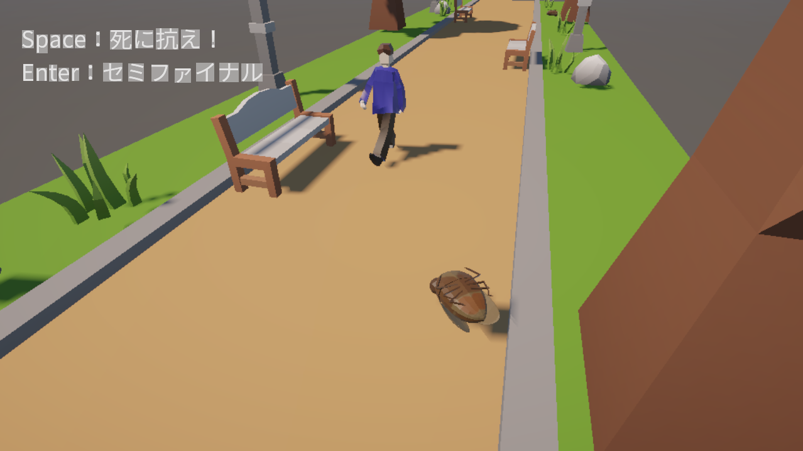
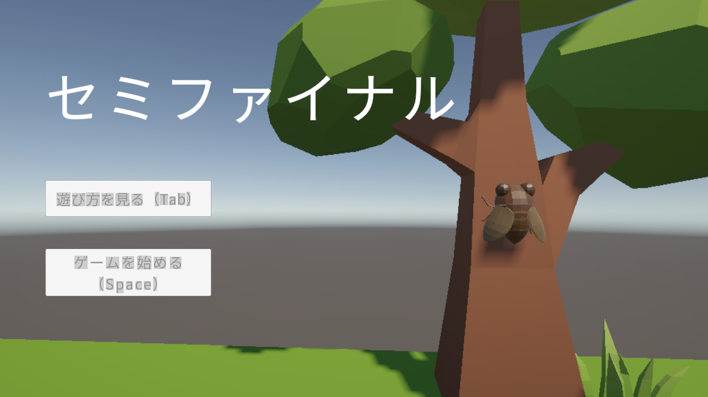
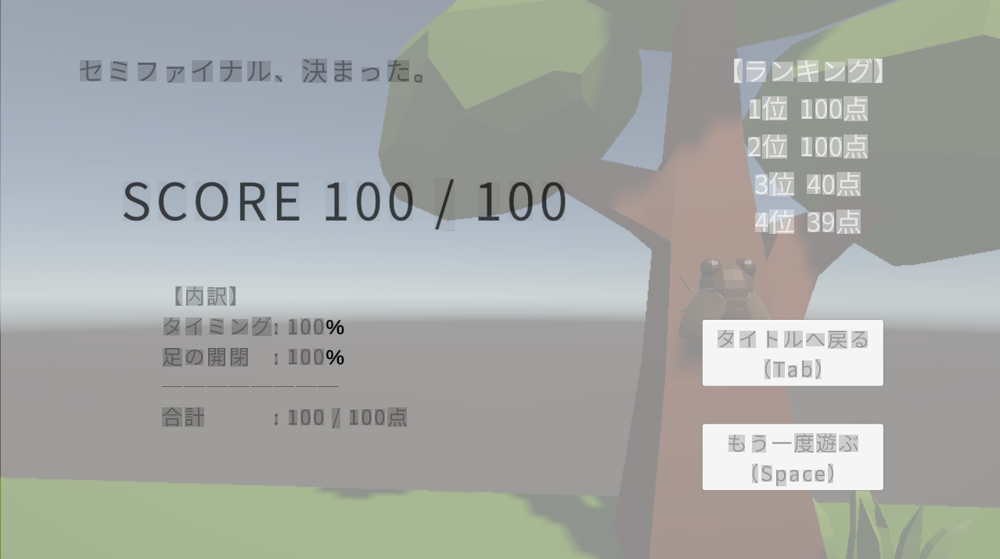
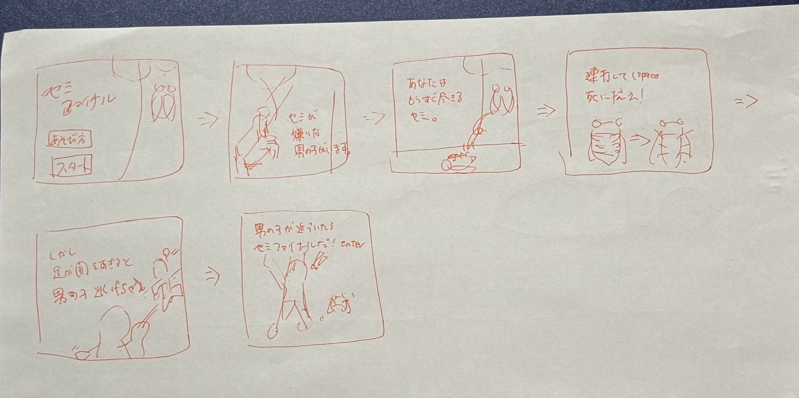
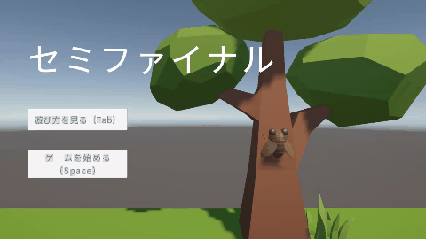

# セミファイナル

> あなたは、もうすぐ尽きるセミ。連打して、死に抗え！

### ▶ [unityroomでプレイする（ブラウザ・約3分）](https://unityroom.com/games/semifinal)

| 項目 | 内容 |
|---|---|
| 制作の形 | 自主制作（イベント参加作品ではなく、自分で企画して制作） |
| 開発期間 | **実装1日**（＋事前に3Dモデル制作） |
| 開発体制 | 個人制作（企画・プログラム・3Dモデル・アニメーション・演出すべて担当） |
| エンジン | Unity / C# / TextMeshPro |
| プラットフォーム | WebGL（PCブラウザ推奨） |
| 公開日 | 2026年8月9日 |

---

## このゲームを作ったきっかけ

私はセミがとても苦手で、夏は外に出られないほどでした。

子どもの頃、両親や祖父母が、セミの抜け殻に色を塗って遊ばせてくれるなど、なんとか私の苦手を克服させようと工夫してくれたことを、今でもよく覚えています。
怖がらせるのではなく、**楽しく、面白おかしく苦手と向き合わせてくれた**その工夫を思い出し、「セミの一生や生き様をゲームにしたら、苦手意識が薄れるのかもしれない」と考えたのが、このゲームの始まりです。

だから本作のセミは、ただ気持ち悪い存在ではなく、**死にかけながらも最後の力で抗う、ちょっと応援したくなる主人公**として描いています。

---

## 「セミファイナル」とは

夏になると、道ばたで仰向けにひっくり返り、死んでいるように見えるセミを見かけることがあります。
ところが近づくと、突然「ジジジッ！」と鳴きながら激しく暴れ出し、人を驚かせる――日本のインターネット上では、この現象を「**セミファイナル**」と呼んでいます。

- **言葉の意味**：「セミ」と、最期・最後のあがきを意味する「ファイナル」をかけたブラックジョーク的な造語です（「準決勝＝セミファイナル」との駄洒落にもなっています）
- **広まったきっかけ**：2012年夏、漫画家でWebメディア「オモコロ」のライターでもある凸ノ高秀さんが、セミの生死の見分け方をイラストで紹介したツイートが大きく拡散。その後オモコロにセミファイナルを描いた漫画も掲載され、言葉として定着しました
- **見分け方**：生きているセミは掴まる場所を探して**足を開いている**、死んでいるセミは**足を閉じている**、とよく言われます
- **別名**：突然飛び起きる"トラップ"のようなことから、「セミ爆弾」「セミ地雷」とも呼ばれます

本作の「だんだん閉じていく足を、連打で開いて死に抗う」という操作は、この**足の開き具合で生死が分かる**という見分け方がもとになっています。

---

## どんなゲームか

夏の終わり、道ばたで仰向けになっている死にかけのセミ。それがあなたです。
セミが嫌いな男の子が近づいてきたその瞬間、最後の力を振り絞って暴れる――通称「セミファイナル」を決めてスコアを狙います。

ただし、
- **連打しないと**足が閉じて力尽きてしまう
- **連打しすぎると**生きていることがバレて、男の子に逃げられてしまう
- なのに、**引きつけるほど高得点**

という矛盾した状況の中で、ギリギリの「死んだふり」を続けます。

### 操作方法

| 操作 | キー |
|---|---|
| セミの足を開く（死に抗う） | Space（連打） |
| セミファイナル発動（1ゲームにつき1回） | Enter |
| 遊び方を表示 | Tab |

### 画面

| タイトル | 結果 |
|---|---|
|  |  |

---

## 企画のポイント

### 誰もが知っている「あるある」を、セミの側から遊ぶ
道ばたで死んでいると思ったセミが突然暴れ出してびっくりする――多くの人が一度は経験している現象です。説明がなくても状況が伝わるので、3分で遊べるミニゲームと相性が良い題材だと考えました。

同じ題材の既存作品を調べたところ、どれも「セミを避ける」「死んだセミを探す」といった**人間側**の遊びでした。そこで本作はプレイヤーを**セミ側**にして、「驚かされる怖さ」ではなく「驚かせる快感」を渡すゲームにしています。

### 1つのボタンに、相反する2つの意味を持たせた（三つ巴の設計）
Spaceの連打が、同時に2本のゲージに効きます。

| ゲージ | 連打すると | 放っておくと | 限界に達すると |
|---|---|---|---|
| 足ゲージ（生きるための綱） | 足が開く | 足が閉じていく | 力尽きる |
| 警戒ゲージ（バレないための綱） | 上がる | 冷めていく | 逃げられる |

さらに得点は「男の子が近いほど高い」ので、待てば待つほど両方のリスクが増えていきます。
**連打しないと死ぬ／連打するとバレる／でも引きつけたい**。この三つ巴で、単純な連打が「波を作る」駆け引きに変わります。

### 連打と発動は別のキーに
連打と発動を同じキーにすると、連打の勢いで誤って発動してしまいます。連打は Space、一発勝負のセミファイナルは Enter と分けて、暴発を防いでいます。

### 前作のフィードバックから生まれた「動くチュートリアル」
前作『[後ろの白い城を白日にしろ！](https://unityroom.com/games/shiroioshiro)』では、遊び方を文字だけで説明していました。
遊んでくれた人から「文字だけの説明は分かりにくい」「あまり読もうと思わず、飛ばしてしまう」という声をもらい、本作ではチュートリアルそのものを作り直しました。

- **ストーリー形式にする**：操作説明を並べるのではなく、自分で描いた絵コンテをもとに、物語を追いながら自然に操作を覚えられる構成に
- **動画のように見られる**：フェードや1文字ずつ表示されるテキストで、読むものではなく「見て楽しい導入」に
- **実際の動きをシミュレーションできる**：本編と同じセミのモデルと足の開閉アニメーションを使い、どう操作するとどう動くのかを遊ぶ前に確かめられるように

1. セミが嫌いな男の子がいます。
2. あなたは、もうすぐ尽きるセミ。
3. 連打（Space）して、死に抗え！
4. でも、足を開きすぎると男の子は逃げちゃう。
5. 男の子が近づいたら……セミファイナル！（Enter）

紙に描いた絵コンテと、完成したチュートリアル画面の比較です。**最初に思い描いたイメージを、ほぼそのまま形にすることができました。**

| 紙の絵コンテ | 完成したチュートリアル |
|---|---|
|  |  |

チュートリアルを「飛ばされるもの」から「ゲームの入り口として楽しいもの」に変えることで、最初の数十秒から世界観に入り込めるゲームになりました。

このチュートリアルを動画にしてXに投稿したところ、**約200件のいいね**をいただきました。チュートリアル自体が、ゲームを知ってもらう宣伝素材としても機能しています。

### セミの鳴き声は、友達の声から自作
イメージに合うセミファイナルの鳴き声がフリー素材では見つからなかったため、**友達の声を録音し、音声編集ソフト（Audacity）で加工して**セミの声を作りました。音声編集は今回が初めてです。
仕上がりにはこだわり、実際に友達に遊んでもらったときも、人の声から作ったと気づかれないほど自然な鳴き声になりました。公開後には、プレイヤーから「セミファイナルの鳴き声がリアル」というコメントもいただいています。

### スコアで「遊んだあと」の楽しみをつくる
結果を点数で出すことで、スコアをシェアしたり、高得点のコツを教え合ったりといった、**遊び終わったあとのコミュニケーション**が生まれるようにしました。実際に複数のプレイヤーが100点満点を達成し、報告してくれています。

---

## 開発経緯

### 1. 着想（2026年7月）
セミが苦手な自分でも楽しめるように、セミの一生や生き様をゲームにできないかと考え始めました。その中で、「死んだと思ったセミが最後の力で暴れる」セミファイナルを題材にしたバカゲーを思いつきました。
既存作品との違いを出すため、**プレイヤーがセミになって人を驚かせる**方向に決めました。

### 2. 最初の設計：「溜めて、離す」
最初は、スペースを長押しして暴れるパワーを溜め、通行人が近づいた瞬間に離す「チャージ＆リリース」型で設計しました。判定は「距離」と「溜め量」の2軸で、1週間 → 土日2日と、開発期間に合わせて要件定義を何度か組み直しています。

### 3. 「1日で作りきる」規模に組み直す
作りかけのまま日をまたぐと集中が途切れてしまうため、自分に合った進め方として、**1日（約8時間）で作りきれる規模**に設計し直しました。
進め方は「先に最後まで遊べる状態を作り、残りの時間で磨く」。どこで手を止めても完成した1本が残る順番で組んでいます。

### 4. 核となる操作の作り直し：「死に抗え！」
設計を詰める中で、操作を大きく変えました。
- まず「足ゲージを連打で閉じて死んだふりを保ち、閉じきると本当に死ぬ」案を考案
- さらに向きを反転し、**だんだん閉じていく足を、連打で開いて死に抗う**形に。これにより、ずる賢く隠れるセミではなく、「死にかけながら最後の一発に懸けるセミ」という物語になりました
- 「人が怪しんで避けていく」演出はアニメーションの負荷が大きいため、**警戒度をゲージで見せる**方式を採用。連打するとバレるというコストが生まれ、三つ巴の設計が完成しました
- 連打と発動を別キーに分け、判定はシビアめに設定

### 5. 前作のフィードバックを反映したチュートリアル
前作の白ジャムで受けた「文字だけの遊び方説明は分かりにくく、飛ばしてしまう」という声を受けて、ストーリー形式で、実際の動きをシミュレーションできる動的なチュートリアルを設計しました。

### 6. 制作・公開（2026年8月9日）
セミと男の子の3Dモデルを自作してインポートし、足の開閉アニメーションも自分で作成。本編とチュートリアルの両方に組み込み、unityroomで公開しました。

---

## プレイヤーの反応
- チュートリアル動画のXへの投稿が **約200いいね**
- 閲覧数 **400回以上**
- 複数のプレイヤーが **100点満点** を達成
- 「セミがかわいい」「3Dモデルが良い」「セミファイナルの鳴き声がリアル」といったコメントをいただきました
- 中国語圏のプレイヤーからもコメントが届きました

---

## 実装のポイント

<!-- TODO: pushしたスクリプトを読んで記入します -->

| スクリプト | 役割 |
|---|---|
| `Assets/Scripts/xxxx.cs` | （例）足ゲージ・警戒ゲージの増減 |
| `Assets/Scripts/xxxx.cs` | （例）男の子の接近・逃走 |
| `Assets/Scripts/xxxx.cs` | （例）セミファイナル発動と判定・スコア計算 |
| `Assets/Scripts/xxxx.cs` | （例）紙芝居チュートリアル |

### WebGL公開での工夫
- 日本語テキストがWebGLで文字化け（□表示）しないよう、ゲーム内で使う文字を洗い出してTextMeshProの日本語フォントアセットを作成

---

## 使用素材
- セミ・男の子の3Dモデル、足の開閉アニメーション：自作
- セミの鳴き声：自作（友達の声を録音し、Audacityで加工）
<!-- TODO: 効果音・BGM・フォントなど使った素材を追記 -->

## 制作者
**gapu（角川 花歩）**
- unityroom：[unityroom.com/users/gapu](https://unityroom.com/users/gapu)
- X：[@gapu_dev](https://x.com/gapu_dev)
- ポートフォリオ：[kaho-sumikawa.github.io/Kaho.Portfolio](https://kaho-sumikawa.github.io/Kaho.Portfolio/)
